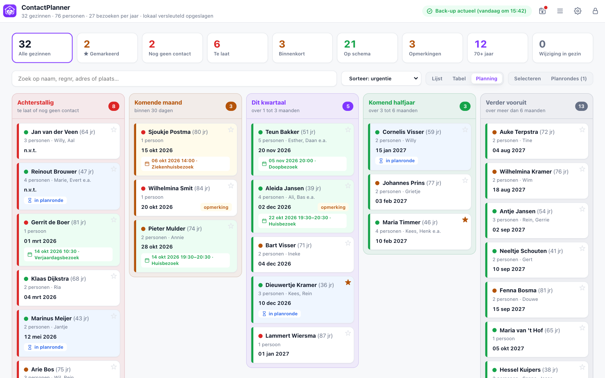
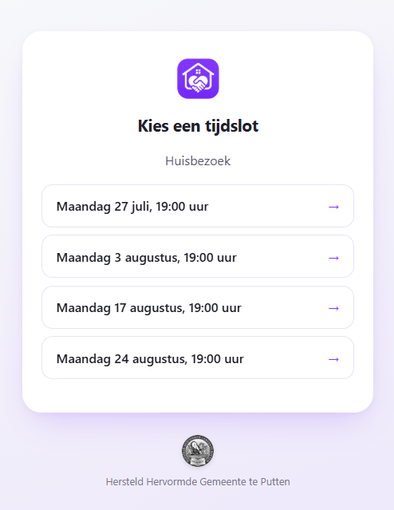
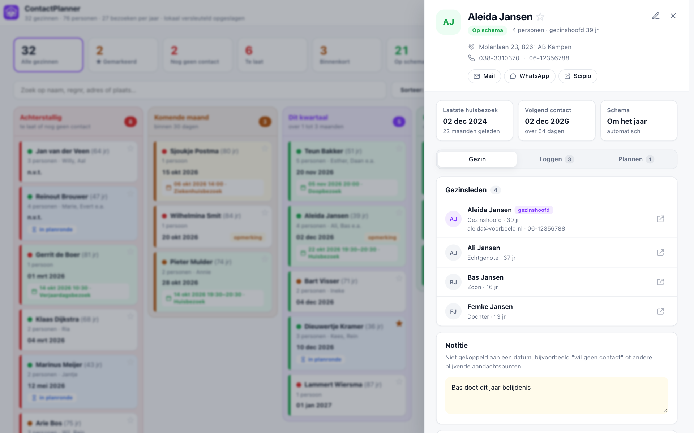
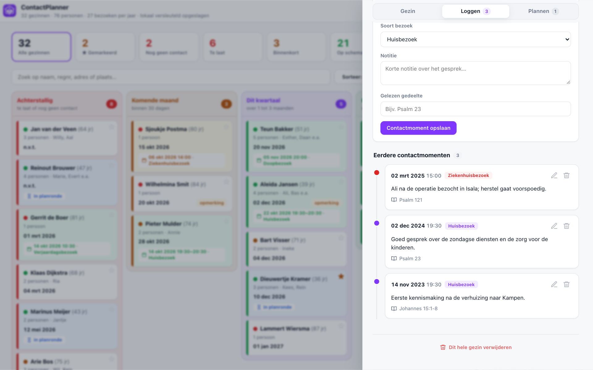
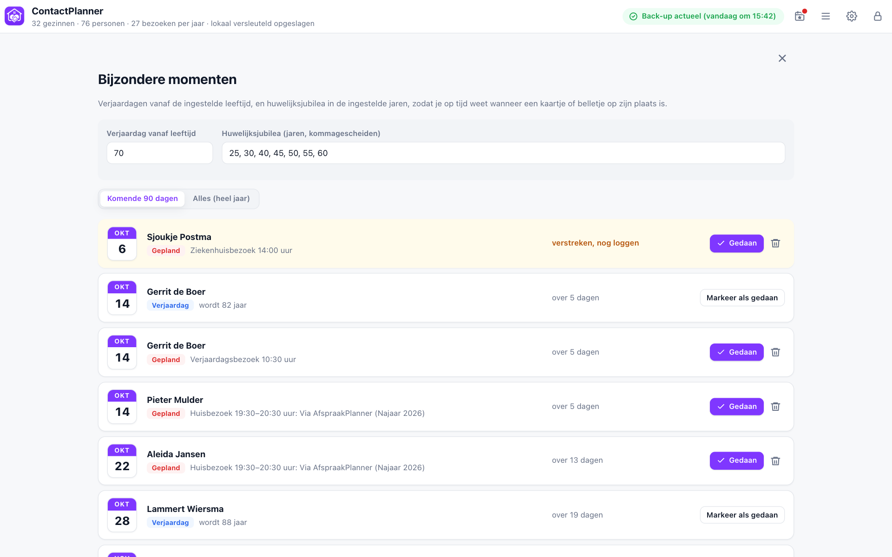
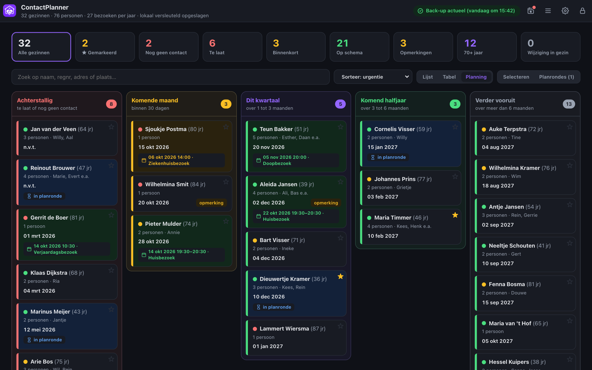
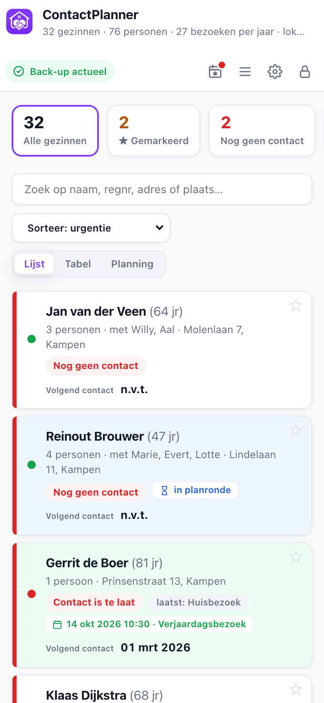
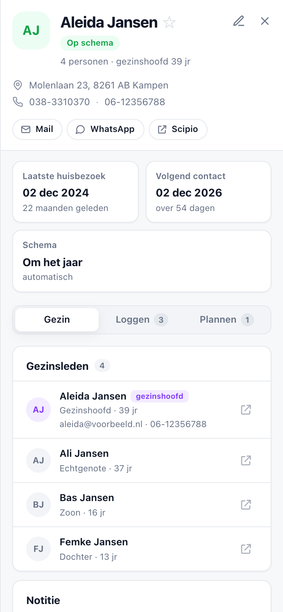
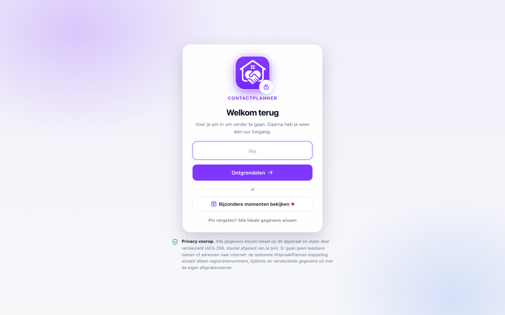

# Contactplanner

ContactPlanner helpt ouderlingen en bezoekbroeders om op een rustige, overzichtelijke manier
contact te onderhouden met gemeenteleden die in Scipio staan. Importeer de ledenlijst en houd
per gezin bij wanneer er contact is geweest, wat er besproken is en wanneer een volgend bezoek
passend is. Zo blijft er ruimte voor persoonlijke aandacht, zonder dat het overzicht verloren
gaat.



<table>
  <tr>
    <td>
      Met de gekoppelde AfspraakPlanner maak je het plannen van een bezoek ook voor
      gemeenteleden eenvoudig. Deel de uitnodiging gemakkelijk via WhatsApp of e-mail;
      vervolgens kiest iemand zelf een geschikt moment uit de aangeboden tijdsloten.
      Daarna zie je direct wie al heeft gekozen, en komt de gekozen afspraak vanzelf in de
      planning te staan.
    </td>
    <td width="320">
      
    </td>
  </tr>
</table>

## 🔒 Privacy voorop

**Deze applicatie verstuurt niets naar internet.** Er is geen server en geen database: alle
gegevens staan uitsluitend in de browseropslag (IndexedDB) van het apparaat waarop je de app
gebruikt, en worden daar **versleuteld** bewaard (AES-256-GCM; de sleutel wordt met PBKDF2
afgeleid van de pin, de pin zelf wordt nergens opgeslagen). Sluit je de browser, dan blijven
de gegevens lokaal bewaard; een ander apparaat of een andere browser ziet ze niet.
Uitzondering op de versleuteling: een klein hulplijstje met verjaardagen/jubilea (naam +
datum), zodat "Bijzondere momenten" ook vanaf het slotscherm te bekijken is.

Daar horen twee verantwoordelijkheden bij:

- **Maak regelmatig een back-up.** De gegevens bestaan alleen op jouw apparaat, en een
  vergeten pin betekent dat de versleutelde gegevens definitief onleesbaar zijn. De indicator
  rechtsboven in de app houdt je scherp: groen = alles staat in de laatste back-up, oranje =
  er zijn wijzigingen die nog niet in een back-up staan. Eén klik op de indicator downloadt
  direct een nieuw back-upbestand (.json). De back-up is bewust **onversleuteld**, want dat is je
  vangnet bij een vergeten pin. Bewaar het bestand op een veilige plek.
- **Beveilig het apparaat zelf.** Een korte cijferpin beschermt tegen meekijkers, maar is
  offline te raden door wie het versleutelde bestand kopieert. Gebruik dus een eigen account
  met schermvergrendeling en een versleutelde schijf, of kies een langere pin (alle tekens
  zijn toegestaan).

⚠️ Ledengegevens (Excel-bestanden, back-up-json's) horen **nooit** in deze repository. De
`.gitignore` weert ze, maar blijf er zelf ook op letten.

## Functies

- **Excel-import met kolomkoppeling**: kies zelf het tabblad, de kop-rij en welke kolom bij
  welk veld hoort. Bij een nieuwe import blijven alle eigen gegevens (contactmomenten,
  notities, schema's) bewaard; een importrapport toont wie nieuw is, wie verhuisde en wie
  wegviel. Met schuifjes kies je wie blijft staan (standaard iedereen) en welke dossiers
  meeverhuizen; "Bijwerken" voert die keuzes in één keer uit. Valt daarbij een heel gezin weg,
  dan waarschuwt de app dat de contactmomenten verloren gaan en biedt eerst een
  overdrachtskaart aan.
- **Gezinnen**: personen worden op adres + postcode gegroepeerd; het gezinshoofd bepaalt de
  weergegeven naam en contactgegevens.
- **Contactmomenten**: log bezoeken met datum, tijd, soort (huisbezoek, doopbezoek,
  huwelijksbezoek, ziekenhuisbezoek, anders), notitie en gelezen gedeelte.
- **Automatisch terugkeerschema**: het bezoekinterval wordt berekend uit de leeftijd van het
  gezinshoofd en de gezinssamenstelling (standaard: tot 70 jaar om het jaar, vanaf 70 als
  stel 1× per jaar, alleenwonend 2× per jaar). Leeftijdsgrens en intervallen zijn instelbaar
  via ⚙ → Instellingen; per gezin kun je ook een handmatig schema kiezen.
- **Bezoeken per jaar**: bovenin staat naast het aantal gezinnen en personen hoeveel
  huisbezoeken er per jaar nodig zijn om iedereen volgens schema te bezoeken: 2× per jaar
  telt 2, 1× per jaar telt 1, om het jaar telt ½ (het totaal over twee jaar gedeeld door
  twee, naar boven afgerond). Zo weet je hoeveel bezoekavonden je minimaal vrij moet houden.
  Gezinnen die niet meer in de laatste import voorkomen tellen niet mee.
- **Weergaven**: lijst, twee kolommen, sorteerbare tabel en een planbord (achterstallig /
  komende maand / dit kwartaal / komend halfjaar / verder vooruit).
- **Bijzondere momenten**: verjaardagen vanaf een instelbare leeftijd, huwelijksjubilea in
  instelbare jaren en zelf ingeplande bijzondere bezoeken. Te openen via het kalendericoon
  rechtsboven, dat een rood attentiestipje krijgt zodra er binnen 14 dagen iets aankomt.
- **Datum afspraak voorstellen**: e-mail- of WhatsApp-bericht met invulbaar sjabloon (de
  standaardtekst draagt het voorbehoud *D.V.*), en een Scipio-link per persoon.
- **AfspraakPlanner-koppeling**: zet vanuit het planbord een aanvraag uit waarbij gezinnen
  zelf een tijdslot kiezen (via de losse AfspraakPlanner-app). Op de pagina Planrondes
  (☰ → Planrondes, of de knop in de planningweergave) volg je wie al gekozen heeft; een gekozen
  tijdslot komt automatisch als gepland contactmoment in het gezinsdossier en in Bijzondere
  momenten.
- **Pin-beveiliging met versleuteling**: de gegevens worden met een van de pin afgeleide
  sleutel versleuteld opgeslagen; na ontgrendelen een uur toegang, of eerder vergrendelen met
  het slot-icoon rechtsboven. De pin wijzig je via ⚙ → Instellingen → Beveiliging.
  Bijzondere momenten zijn ook zonder pin in te zien (zonder gezinsdossiers).
- **Licht en donker**: via ⚙ → Instellingen → Weergave kies je Automatisch (volgt de
  instelling van je computer of telefoon), Licht of Donker. De keuze geldt per apparaat en
  gaat niet mee in de back-up; de overdrachtskaart blijft altijd licht, want die is om af te
  drukken.
- **Nederlandse notatie**: datums altijd als dd/mm/jjjj en tijden in 24-uursnotatie, ongeacht de
  taal van de browser. Snel typen mag ook (bijv. `1930` of `14-10-2026`); de kalenderknop opent
  de datumkiezer van de browser.
- **Offline en installeerbaar (PWA)**: eenmaal geopend werkt de app zonder internet en kun
  je hem via "Installeren" / "Zet op beginscherm" als losse app gebruiken.

### Menu

Rechtsboven staan, naast de back-upindicator, vier iconen:

| Icoon | Wat het doet |
|---|---|
| 📅 (kalender met ster) | Opent Bijzondere momenten; rood stipje = er komt binnen 14 dagen iets aan |
| ☰ | De onderdelen van de app: Bijzondere momenten, Planrondes en, als die functie aanstaat, Bijbelgedeelten |
| ⚙ | Beheer: Instellingen, de gegevens (Excel-import en -export, back-up maken en terugzetten) en hulp (Handleiding, Release historie, Debug) |
| 🔒 | Direct vergrendelen |

Klik op het logo linksboven om vanuit elk scherm terug te gaan naar het hoofdscherm.

De volledige uitleg staat in de app zelf: ⚙ → **Handleiding**.

## Rondleiding

De schermafbeeldingen hieronder zijn gemaakt met een fictieve wijk; namen, adressen en
contactmomenten zijn verzonnen.

### Planbord

Het planbord staat bovenaan deze pagina. Elk gezin staat in de kolom die past bij het volgende
contactmoment, van *Achterstallig* tot *Verder vooruit*. De kleur van een kaart laat zien wat er speelt: lichtgroen is een gepland
moment, lichtblauw een uitstaande planronde in AfspraakPlanner, lichtgeel een gepland moment dat
voorbij is en nog gelogd moet worden. Bovenin filter je met de tellers, en de topbalk toont hoeveel
huisbezoeken er per jaar nodig zijn.

### Gezinsdossier

Klik op een gezin voor het dossier: status, adres en contactgegevens bovenin, met knoppen voor
mail, WhatsApp en Scipio. Daaronder het laatste huisbezoek, het volgende contact en het schema in
één oogopslag, en de tabbladen *Gezin*, *Loggen* en *Plannen*.



Onder *Loggen* staan alle contactmomenten als tijdlijn, het nieuwste bovenaan, met de soort
bezoek, de notitie en het gelezen gedeelte.



### Bijzondere momenten

Verjaardagen, huwelijksjubilea en zelf ingeplande momenten op een rij, met een datumblokje en
hoe lang het nog duurt. Een rood stipje op het kalendericoon rechtsboven waarschuwt als er binnen
14 dagen iets aankomt.



### Licht en donker

Via ⚙ → Instellingen → Weergave kies je Automatisch, Licht of Donker.



### Op de telefoon

De app werkt ook op een smal scherm: de tellers worden een veegbare rij en het dossier vult het
hele scherm.

<table>
  <tr>
    <td></td>
    <td></td>
  </tr>
</table>

### Vergrendeld

Na een uur, of met het slotje rechtsboven, vergrendelt de app. Ontgrendelen gaat met je pin;
bijzondere momenten zijn ook zonder pin in te zien.



## Aan de slag

1. Open de app (zie *Hosten* hieronder, of open `index.html` lokaal in een browser).
2. Stel bij het eerste gebruik een pin in (minimaal 4 tekens). **Onthoud deze goed**: de
   gegevens worden met deze pin versleuteld; bij een vergeten pin is de enige weg terug alle
   lokale gegevens wissen en een back-up terugzetten.
3. Kies een Excel-bestand met de ledengegevens, of zet een eerder gemaakte back-up (.json)
   terug. Regnr. en Naam zijn verplichte kolommen; Regnr. is het kenmerk waarmee personen
   bij een volgende import worden herkend.

## Back-ups en verhuizen naar een ander apparaat

De browseropslag is gebonden aan de herkomst (origin): wissel je van computer, van browser,
of van een lokaal geopend bestand naar de online versie, dan begint de app daar leeg. Zo
neem je alles mee:

1. **Oude omgeving:** klik op de back-upindicator rechtsboven (of ⚙ → *Back-up maken*)
   en bewaar het `.json`-bestand.
2. **Nieuwe omgeving:** stel een pin in en kies op het startscherm
   *"of zet een eerdere back-up terug (.json)"*.

In de back-up zitten alle personen, gezinsgegevens, contactmomenten, notities, lopende
AfspraakPlanner-aanvragen én (sinds back-upversie 3) de instellingen. Alleen de pin gaat bewust niet mee; die stel je op het
nieuwe apparaat opnieuw in. Het bestand is bewust onversleuteld (vangnet bij een vergeten
pin), dus bewaar het veilig. Oudere back-upformaten blijven gewoon inleesbaar.

## Hosten op GitHub Pages

1. Zet deze repository op GitHub.
2. Ga naar **Settings → Pages**, kies **Deploy from a branch**, branch `main`, map `/ (root)`.
3. De app staat daarna op `https://<gebruikersnaam>.github.io/<repo>/`.

De repository bevat geen gegevens, dus publiek hosten is dus veilig: iedere bezoeker krijgt een
lege app die alleen met de eigen, lokale gegevens werkt.

## Voor wie aan de code werkt

Statische site zonder build-stap: bewerk de bestanden en ververs de browser. Lokaal
bekijken gaat het makkelijkst met een eenvoudige webserver in de projectmap:

```sh
python3 -m http.server 8000
```

en dan `http://localhost:8000`. Let op: de browser en de service worker kunnen een oude
versie van `styles.css`/`app.js` blijven tonen. Ververs dan hard (Cmd+Shift+R), of vink in de
ontwikkelaarstools onder *Netwerk* "Cache uitschakelen" aan.

| Bestand | Inhoud |
|---|---|
| `index.html` | Pagina-skelet, laadt de overige bestanden |
| `app.js` | Alle applicatielogica en UI (templates + events) |
| `styles.css` | Vormgeving; alle kleuren staan als variabelen in `:root`, met een donkere set eronder |
| `sw.js` | Service worker: offline-cache |
| `manifest.webmanifest` | PWA-manifest (naam, iconen, kleuren) |
| `icons/` | App-iconen (192 en 512 px) |
| `img/` | Schermafbeeldingen voor deze README (gemaakt met fictieve testgegevens) en afbeeldingen voor de uitleg in de app (o.a. Scipio-uitvoerscherm) |
| `vendor/xlsx.full.min.js` | [SheetJS Community Edition](https://sheetjs.com) **0.20.3**, vastgepind (van cdn.sheetjs.com, want npm stopt bij 0.18.5 met bekende CVE's) |

Gegevensopslag: IndexedDB met als kern de store `kluis`: daarin staan alle personen en
gezinsgegevens als één AES-256-GCM-versleuteld blok. Daarnaast `instellingen` (onversleuteld:
schema-instellingen, pin-zout, sleutelcontrole, mijlpalen-cache, kleurmodus) en de legacy-stores
`personen`/`gezinsdata` die alleen nog dienen voor de eenmalige migratie van oudere
installaties en als vangnet in browsers zonder Web Crypto. De gekozen kleurmodus staat
daarnaast ook in `localStorage` (`contactplanner-kleurmodus`), zodat `index.html` hem al
toepast vóórdat IndexedDB geladen is, anders zou een donkere gebruiker eerst een lichte
flits zien.

**Datum- en tijdvelden:** gebruik geen `<input type="date">` of `type="time"`; die volgen de
taal van de browser (bij Engels (VS) mm/dd/jjjj en AM/PM). Gebruik `datumVeldHTML(attrs, iso)`
voor een datum en `tijdveldAttr()` voor een tijd. Het datumveld toont dd/mm/jjjj, maar het
verborgen datumveld erachter houdt de id/data-attributen en de ISO-waarde, en krijgt een
`change`-event; bestaande handlers hoeven dus niets anders te doen.

**Licht en donker:** gebruik in `styles.css` altijd de kleurvariabelen (`var(--surface)`,
`var(--text)`, …) in plaats van vaste kleuren. Een nieuwe kleur voeg je toe aan `:root` én
aan beide donkere blokken (`@media (prefers-color-scheme: dark)` en
`:root[data-theme="dark"]`). Zonder `data-theme` op `<html>` volgt de app het systeem;
Instellingen zet `data-theme="light"` of `"dark"` bij een bewuste keuze.

**Belangrijk bij elke wijziging die je publiceert:** verhoog `CACHE_VERSIE` in `sw.js`
(bijv. `contactplanner-v2`), anders blijven bestaande bezoekers op de oude offline-versie
hangen tot hun service worker ververst.

Werk daarnaast `APP_VERSIE` in `app.js` bij: het versienummer onderin het ⚙-menu. Dit is een
los, semantisch nummer met als notatie `bestaansjaar.maand.releasenr`: het eerste cijfer is
in welk jaar sinds de start van de app je zit (1 = het eerste jaar), het tweede de
kalendermaand, en het derde het releasenummer in die maand (begint weer bij 1 in een nieuwe
maand).

De oorspronkelijke alles-in-één-versie (`contactplanner.html`, gebouwd in Claude) is bij de
opsplitsing naar deze structuur verwijderd.
